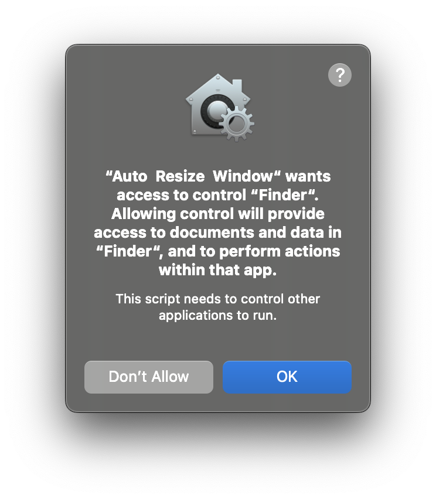

# Auto Resize Window
> This only works on Mac OS
This is an AppleScrip app that automatically resizes the active window to various 16:9 aspect ratios. This is useful for automatically resizing an app window before a screencast or screen share.

This was written in AppleScrip and only works on Mac OS.

## Usage
1. Download the app zip file from [here](/Users/cokoghenun/Sandbox/auto-resize-window/Auto Resize Window.zip)
1. Extract the app from the zip file
1. Move the app to your `Applications` folder
1. Open up Spotlight (`cmd+spacebar`) and type in `Auto Resize Window`
1. Hit enter
1. Select a resolution and profit

## Important ⚠️
You will need to give this application access to `System Events` and `Finder` on the first run.

You can take a look at the source script [here](Auto Resize Window.app/Contents/Resources/Scripts/main.scpt) to be sure.

